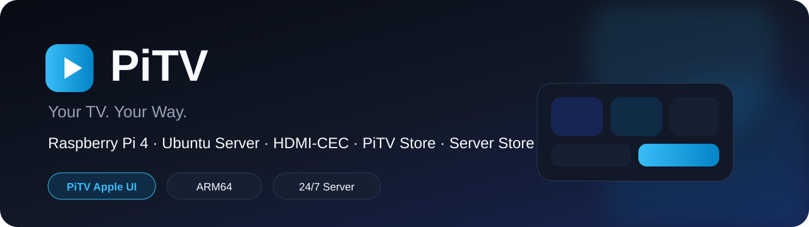

<p align="center">
  
</p>

<p align="center">
  <a href="README.md"></a>
  
</p>

<p align="center">
  A lightweight TV launcher for <strong>Raspberry Pi 4</strong> combining a custom TV interface, apps and 24/7 server services on one device.
</p>

<p align="center">
  
  
</p>

<p align="center">
  <a href="https://github.com/CaseyCZ/PiTV/releases/tag/alpha"></a>
  <a href="FLASHER.md"></a>
  <a href="INSTALL_EN.md"></a>
  <a href="https://github.com/CaseyCZ/PiTV/issues"></a>
</p>

## About

**PiTV** is a custom TV environment for Raspberry Pi 4 built on **Ubuntu Server 24.04 ARM64**.

The Raspberry Pi remains a full 24/7 server while HDMI provides a dedicated TV interface controlled through **HDMI-CEC**.

PiTV does not require a full desktop such as GNOME. The graphical layer runs on lightweight **labwc / Wayland**, leaving the same Raspberry Pi available for Homebridge, Tailscale, Docker and other background services.

## Main features

- 📺 custom fullscreen TV launcher
- 🎨 **PiTV Apple Dark** and **PiTV Apple Light**
- 🎮 **HDMI-CEC** remote control
- 🔊 HDMI audio
- 💤 clock screensaver, black screen and optional CEC standby
- 📡 Wi-Fi and basic network management from the TV
- 📦 **PiTV Store** for TV apps
- 🖥️ **Server Store** for 24/7 services
- 🤖 **Waydroid + Google Play** for Android TV apps
- ⬆️ PiTV, catalog, app and Ubuntu updates
- 🌡️ system information — temperature, RAM, disk, uptime, kernel, network and Tailscale
- 🔄 self-update while preserving user configuration

## Download

The current test build is always available from the single **[PiTV Alpha Release](https://github.com/CaseyCZ/PiTV/releases/tag/alpha)**.

On Windows download the single installer package **`PiTV-SD-Installer-Windows.zip`**, extract it and run **`Start-PiTV-SD-Installer.cmd`**. The launcher checks the latest GitHub Release on every start and runs the current installer.

Linux and macOS use `tools/pitv-flasher.sh` directly from the repository. GitHub automatically adds Source code ZIP/TAR.GZ to each Release.

## Installation

### PiTV SD Installer — recommended

Prepare the microSD card directly from a computer.

| Platform | Method |
|---|---|
| **Windows** | run `tools/windows/Start-PiTV-SD-Installer.cmd`, select the card and click **CREATE PiTV SD** |
| **Linux** | run `tools/pitv-flasher.sh` |
| **macOS** | run `tools/pitv-flasher.sh` |

The Windows installer offers **Raspberry Pi 3 / 3B+**, **Raspberry Pi 4** and **Raspberry Pi 5**. Pi 4 is the default and recommended target; Pi 3 and Pi 5 remain experimental during Alpha.

The installer prepares Ubuntu Server 24.04 ARM64, Wi-Fi, first boot and automatic PiTV installation. Image writing is delegated to the official Raspberry Pi Imager.

Details: **[PiTV SD Installer](FLASHER.md)**

### Restore / format an SD card

The Windows GUI includes **FORMAT SD**. It wipes the selected card and creates one exFAT `SDCARD` partition using the available capacity.

Windows PowerShell:

```powershell
.\tools\pitv-flasher.ps1 -FormatOnly
```

Linux / macOS:

```bash
./tools/pitv-flasher.sh --format-only
```

### Manual install

On a prepared **Ubuntu Server 24.04 ARM64** system:

```bash
git clone https://github.com/CaseyCZ/PiTV.git
cd PiTV
sudo ./install.sh
sudo reboot
```

Full manual guide: **[INSTALL_EN.md](INSTALL_EN.md)**

## PiTV Store

| App | Installation |
|---|---|
| Kodi | Ubuntu APT |
| SmartTube | ARM64 GitHub release |
| Stremio | Linux Flatpak (`com.stremio.Stremio`) |
| YouTube | Google Play / Waydroid |
| Spotify | Google Play / Waydroid |
| Plex | Kodi + PM4K (Linux) |

PiTV validates the expected package ID for direct APK installs.

## Server Store

| Service | Purpose |
|---|---|
| Homebridge | HomeKit bridge + web UI |
| Tailscale | remote access / VPN |
| Docker Engine | containers |
| ATVLoadly | Apple TV sideload server |

These services continue running while the TV is off or asleep.

## Android / APK

Waydroid is optional. PiTV also works as a pure Linux TV launcher.

Install from:

**Settings → Android / APK → Waydroid + Google Play → Install**

PiTV first uses the official `repo.waydro.id` source. If it is unavailable or package installation fails, PiTV automatically switches to a **fallback snapshot** stored in this repository. The Ubuntu 24.04 / ARM64 snapshot includes the required Waydroid runtime packages, SHA-256 checksums and is refreshed weekly from the official source.

Custom APK files:

```text
/var/lib/pitv/apks/
~/PiTV/APKs/
```

## Remote control

| Button | Action |
|---|---|
| Arrows | navigation |
| OK / Enter | confirm |
| Back | back |
| Home / Menu | return to PiTV |
| Volume ± | TV / receiver |
| Mute | mute |

PiTV uses one persistent CEC client for both input and outgoing commands.

## Requirements

Recommended setup:

- **Raspberry Pi 4** — primary and recommended target
- Raspberry Pi 3 / 3B+ — Alpha, lower performance
- Raspberry Pi 5 — Alpha, hardware not physically verified yet
- 32 GB or larger microSD
- Ubuntu Server 24.04 LTS ARM64
- micro-HDMI → HDMI
- quality USB-C power supply
- Wi-Fi or Ethernet
- HDMI-CEC capable TV

## Project status

PiTV is currently **Alpha / active development**.

Automated tests cover syntax, catalogs, all UI screens, both themes, Ubuntu 24.04 x64/ARM64 install/start/update/uninstall, Kodi Store installation, Android APK sources and Server Store services.

Physical Raspberry Pi 4 testing still covers HDMI/KMS, real TV CEC behavior, HDMI audio, Kodi hardware decoding and Waydroid GPU/kernel compatibility.

See **[AUDIT.md](AUDIT.md)**.

## Credits

PiTV builds on the work of several open-source projects and services:

- **Raspberry Pi** — hardware and Raspberry Pi Imager
- **Ubuntu** — server base
- **labwc / Wayland** — lightweight graphical environment
- **Pygame** — PiTV UI runtime
- **libCEC / cec-utils** — HDMI-CEC communication
- **Waydroid** — Android environment
- **Kodi** — Linux media center
- **Homebridge** — HomeKit bridge
- **Tailscale** — mesh VPN
- **Docker** — containers
- **Stremio and Plex** — Linux/Kodi paths; **SmartTube, Spotify and YouTube** — Android/Waydroid apps available through PiTV Store

PiTV is not an official product of these projects. Product names and trademarks belong to their respective owners.

## Links

<p>
  <a href="FLASHER.md"></a>
  <a href="INSTALL_EN.md"></a>
  <a href="AUDIT.md"></a>
  <a href="CHANGELOG.md"></a>
  <a href="SECURITY.md"></a>
</p>

## License

PiTV is released under the **MIT License**. See **[LICENSE](LICENSE)**.

Third-party projects and applications keep their own licenses and terms.

## Support

<p align="center">
  <a href="https://www.buymeacoffee.com/caseycz"></a>
</p>

<p align="center">
  <a href="https://www.buymeacoffee.com/caseycz"></a><br>
  <sub>Scan the QR code or click the button.</sub>
</p>

<p align="center">
  <a href="https://caseycz.github.io/"></a>
</p>
